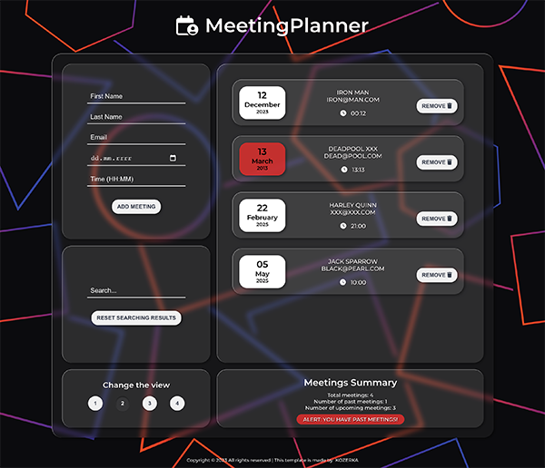
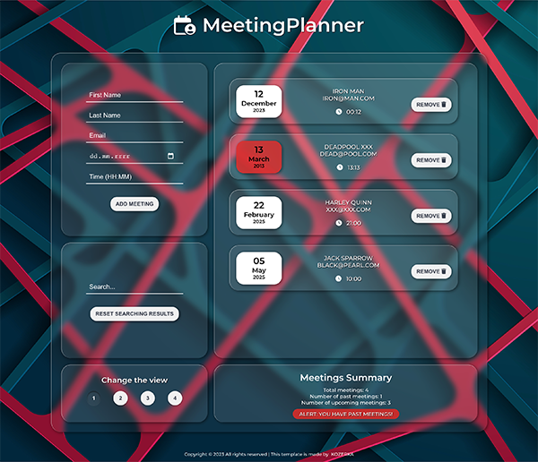
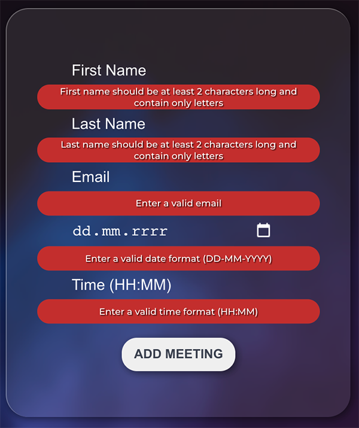
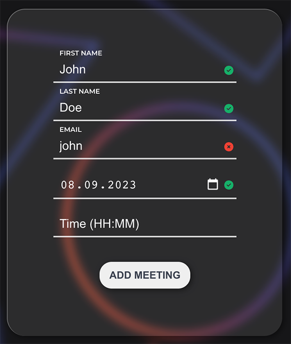
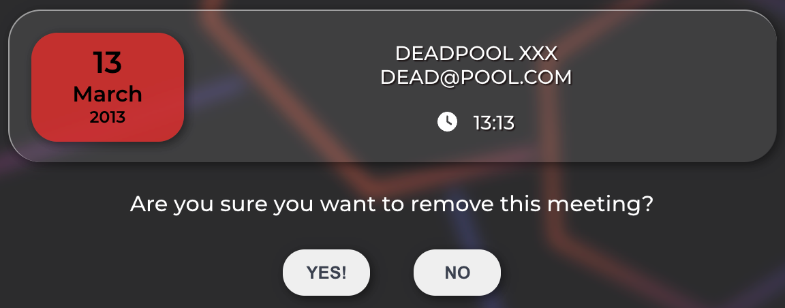
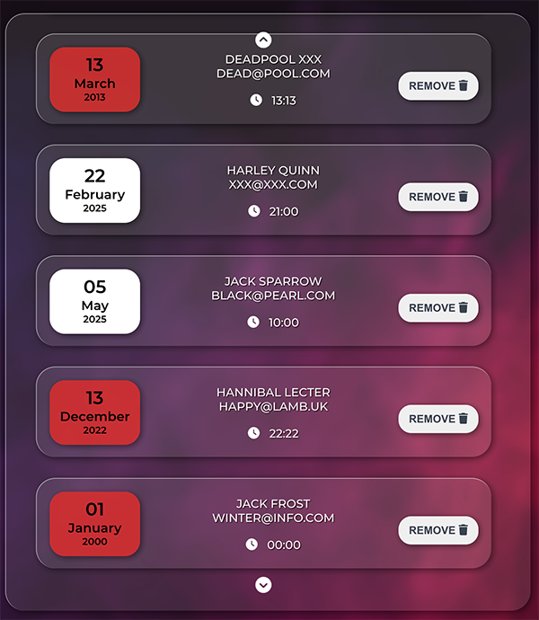
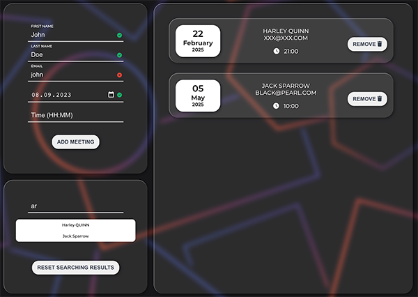

##  MeetingPlanner

<div style="display: flex; justify-content: center;">
    <div style="padding: 10px; box-sizing: border-box;">
        
    </div>
    <div style="padding: 10px; box-sizing: border-box;">
        
    </div>
</div>


🚀 **Overview**

MeetingPlanner is a simplified appointment scheduling application. It allows for efficient organization of meetings in a simple yet modern interface.

🖥 **Features**

- **Easy Data Input**: A straightforward form captures essential information about appointments: date, time, first name, last name, and email.
- **Data Storage**: Data is stored in a `.json` file, accessed using a local API, ensuring you always have offline access to your information.
- **Modular Components**: The app employs a clean separation of concerns through component-based architecture, facilitating easy future updates and ensuring efficient data flow through `state` and `props`.
- **Validation**: Each input character is validated, ensuring data consistency and correctness.
<div style="display: flex; justify-content: center;">
    <div style="padding: 10px; box-sizing: border-box;">
        
    </div>
    <div style="padding: 10px; box-sizing: border-box;">
        
    </div>
</div>

- **Date Validation for Meetings**:To enhance user experience and maintain accuracy, we've introduced a date validation mechanism. Now, when scheduling or rescheduling a meeting (No Past Dates Allowed: Users cannot select a date that's in the past. The application will provide a validation message if an attempt is made to choose an older date than the current one. This ensures that all scheduled meetings are either set for the current day or a future date.)
- **Past Meeting Indicator** - Meetings that have already occurred will now be marked with an exclamation icon next to their date. This visual cue makes it straightforward to identify which meetings have elapsed and which are upcoming.
- **Changing the background view**: User can change the view from among the four available backgrounds.
- **Safety**: Before any meeting data is deleted, there's a re-verification step to prevent accidental deletions.

<div style="display: flex; justify-content: center;">
    
</div>

- **Scroll**: In case of too many meetings - the ability to scroll elements in the container.
<div style="display: flex; justify-content: center;">
    
</div>
<br/>
&nbsp;

🛠 **Set-Up**

The project uses [node](https://nodejs.org/en/), [npm](https://www.npmjs.com/) and [JSON server](https://www.npmjs.com/package/json-server), follow the steps below to run it locally.

- Clone the project using

```bash
  git clone
```

- Go to the project directory and install dependencies

```bash
  npm i
```

- Start developers mode

```bash
  npm start
```
- Instal JSON server 

```bash
  npm i json-server
```
- Start JSON server

```bash
  json-server --watch ./db/data.json --port 3005
```
  
**Extras**:

1. **Modular Design**: The application encourages further division into smaller reusable components.
2. **Autocomplete**: As users type in input fields, suggestions are fetched from the API, enabling quicker data input.
<div style="display: flex; justify-content: center;">
    
</div>

<br/>
&nbsp;

🔗 **Related Resources**
- [Create React App Documentation](https://reactjs.org/docs/create-a-new-react-app.html)
- [JSON Server](https://github.com/typicode/json-server)

## License
This project is made available under the MIT license. More details can be found in the LICENSE file in the main directory of the repository.

&nbsp;

## 🙏 Special thanks

Special thanks to my [Mentor - devmentor.pl](https://devmentor.pl/) for providing me with the task.